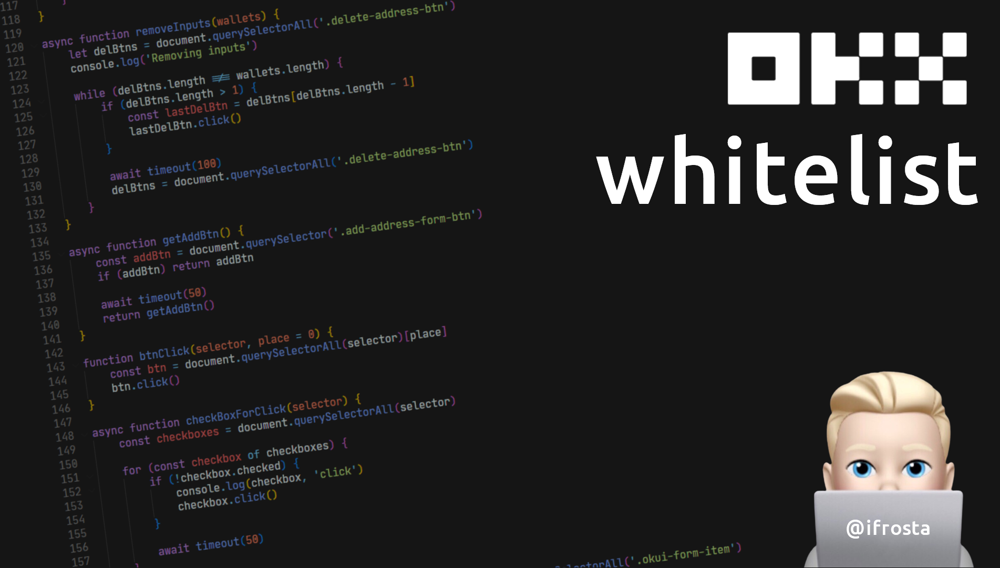
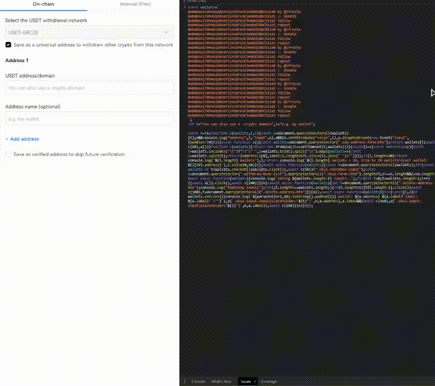

## by [@ifrosta](https://github.com/iFrosta)
### Join [Telegram](https://t.me/onchainsoft)
### Donate: ❤️  ``0xbB86A17094a1D03eF12418F63C9e0dd28BC511e1``


# How to use

1. Open [https://okx.com/balance/withdrawal-address](https://okx.com/balance/withdrawal-address)
1. Open the dev tools. (Ctrl + Shift + I)
2. Press Ctrl + Shift + R (prevent debugger pause)
2. Press on 'Add in batches'
3. Select the withdrawal network
5. Paste the script
6. [Fill](#-how-to-fill-wallets) the wallets with your wallets
7. (Optional) Script will get labels automatically Modify ``t`` and ``o`` if necessary
8. Press enter to run the script
9. Enjoy! ☺️

The script will tick the checkboxes and fill wallets.<br>
If there are more fields than wallets, script will remove unnecessary fields.

# How to fill wallets
``` JavaScript
let wallets = '
    0xbB86A17094a1D03eF12418F63C9e0dd28BC511e1 wallet-1
    0xbB86A17094a1D03eF12418F63C9e0dd28BC511e1 2 test wallet
    0xbB86A17094a1D03eF12418F63C9e0dd28BC511e1
    ...
'
```

``` JavaScript
let wallets=`

`,

inputAddress="Address/domain",
inputLabel="e.g. my wallet",

run=async()=>{console.clear(),console.log(author()),DEBUG&&console.log("DEBUG MODE");let e=getWallets(!0);e=e.slice(0,20),DEBUG&&console.log("Wallets:",e),""===inputAddress&&""===inputLabel&&getLabels(),await checkBoxForClick(FORM_CHECKBOX_SELECTOR);let t=countInputs();t!==e.length&&(t<e.length?await addInputs(e):await removeInputs(e)),await fillWallets(e),await setupDialogButtonListener(e),colorMsg("If everything is OK, press 'Save'","background-color: yellow; color: purple; font-size: 18px;")};const FORM_ADDRESS_LIST_SELECTOR=".balance_okui-form-vertical",TABLE_CONTENT_SELECTOR=".balance_okui-table-content",FORM_ITEM_SELECTOR=".balance_okui-table-row",FORM_ITEM_MD_SELECTOR=".balance_okui-input-md",FORM_CHECKBOX_SELECTOR=".balance_okui-checkbox",INPUT_BOX_SELECTOR=".balance_okui-input-box",INPUT_ADDRESS_SELECTOR=".balance_okui-input-input",INPUT_LABEL_SELECTOR=".balance_okui-input-input",INPUT_ERROR_SELECTOR=".balance_okui-form-item-control-explain-error",BUTTON_ADD_ADDRESS_SELECTOR=".balance_okui,balance_okui-btn,btn-md,btn-outline-secondary",BUTTON_DELETE_ADDRESS_SELECTOR=".icon.iconfont.okds-trash.trash",BUTTON_SAVE_SELECTOR_FIND=".balance_okui,balance_okui-btn,btn-md,btn-fill-highlight",OKX_TEXT_ADDRESS_DUPLICATE_ERROR="This address has already been saved, delete to save again as your chosen type";let BUTTON_SAVE_EL=null;const DEBUG=!1;let RESULT=!1,DUPLICATES=[];function colorMsg(e,t){console.log(`%c${e}`,t)}async function setupDialogButtonListener(e){let t=document.querySelectorAll(".balance_okui,balance_okui-btn,btn-md,btn-fill-highlight"),l=async()=>{DEBUG&&console.log("Save clicked"),await timeout(1200),await savedWalletsHandler(e)},a=Array.from(t).reverse();for(let n of a){let o=n.querySelector("span.btn-content");if(o&&"Save addresses"===o.textContent.trim()){BUTTON_SAVE_EL=n,n.addEventListener("click",l);break}}}async function triggerSave(){let e=BUTTON_SAVE_EL.parentElement;e.click()}async function fillWallets(e){for(let[t,l]of e.entries())console.log(`${parseInt(t+1,10).toString().padEnd(2)} wallet: ${l.address} ${l.label?`label: ${l.label}`:""}`),setInputValue(`${INPUT_ADDRESS_SELECTOR}[placeholder="${inputAddress}"]`,l.index?l.index:t,l.address),l.label&&(await timeout(150),setInputValue(`${INPUT_ADDRESS_SELECTOR}[placeholder="${inputLabel}"]`,l.index?l.index:t,l.label)),await timeout(150)}function setInputValue(e,t,l){let a=document.querySelectorAll(e)[t];DEBUG&&console.log("address",l,"Input",a),a&&(a.setAttribute("value",l),a.dispatchEvent(new Event("input",{bubbles:!0})))}function countTableRows(){let e=document.querySelector(".balance_okui-table-content");DEBUG&&!e&&console.log("NO TABLE FOUND",e);let t=e.querySelectorAll("tr");return DEBUG&&console.log("Rows count:",t.length),t.length-1}async function addInputs(e){console.log(`Adding ${e.length-1} inputs..`);let t=await getAddBtn();for(let l=1;l<e.length;l++){t.click();let a=countTableRows();if(a>=e.length)return;a!==l&&(await timeout(500),t.click()),await timeout(500)}}async function removeInputs(e){let t=document.querySelectorAll(BUTTON_DELETE_ADDRESS_SELECTOR);for(console.log("Removing inputs");t.length!==e.length;){if(t.length>1){let l=t[t.length-1];l.click()}await timeout(100),t=document.querySelectorAll(BUTTON_DELETE_ADDRESS_SELECTOR)}}async function savedWalletsHandler(e){let t=getWallets(),l=await getDuplicatedWallets()||[];if(l.length){colorMsg("Please wait while doing post check..","background-color: yellow; color: purple; font-size: 18px;");let a=[],n=t.reduce((t,n,o)=>(l.includes(n.address)?a.push(o):e.includes(n.address)||DUPLICATES.includes(n.address)||t.push({...n,index:t.length}),t),[]);l.length&&DUPLICATES.push(...l.flat()),DEBUG&&(console.log("Duplicated Wallets:",l.length,l),console.log("Rest of Wallets:",n.length,n),console.log("DUPLICATES",DUPLICATES));let o=n.filter(e=>!DUPLICATES.includes(e.address));if(DUPLICATES.length==t.length)return colorMsg("All wallets already added to whitelist on this chain","color: red; font-size: 14px;"),end();l.length&&o.length?(colorMsg("Sorting duplicates..","color: yellow; font-size: 14px;"),console.log("Replacing already saved wallets",o.length),await fillWallets(o),await timeout(800),await removeDuplicatedWallets(),await timeout(500),await triggerSave(o),await timeout(1200),await savedWalletsHandler(t)):l.length&&!n.length&&removeDuplicatedWallets()}end()}function end(){RESULT||(colorMsg("Done","color: #90EE90; font-size: 18px; font-weight: bold"),console.log(author()),RESULT=!0)}async function getDuplicatedWallets(){let e=OKX_TEXT_ADDRESS_DUPLICATE_ERROR,t=[],l=document.querySelectorAll(INPUT_ERROR_SELECTOR);if(l)return l.forEach(async l=>{if(l.textContent.trim()===e){let a=l.closest(FORM_ITEM_MD_SELECTOR);DEBUG&&console.log("targetParent",a);let n=a.querySelector(INPUT_ADDRESS_SELECTOR);DEBUG&&console.log("inputElement",n);let o=n?n.value:"";DEBUG&&console.log("Duplicate address value:",o),t.push(o)}}),t}async function removeDuplicatedWallets(){DEBUG&&console.log("Removing already saved wallets");let e=OKX_TEXT_ADDRESS_DUPLICATE_ERROR,t=document.querySelectorAll(INPUT_ERROR_SELECTOR);DEBUG&&console.log("elementsWithErrorMessage",t);let l=[];for(let a of t)if(a.textContent.trim()===e){let n=a.closest(FORM_ITEM_MD_SELECTOR);DEBUG&&console.log("targetParent",n);let o=document.querySelectorAll(FORM_ITEM_MD_SELECTOR);DEBUG&&console.log("divs",o);let i=Array.from(o).indexOf(n);if(DEBUG&&console.log("currentIndex",i),i>=2){let s=o[i-2];DEBUG&&console.log("previousDiv",s);let r=s.querySelector(BUTTON_DELETE_ADDRESS_SELECTOR);DEBUG&&console.log("deleteBtnElement",r),r&&(DEBUG&&console.log("Removed already saved addresses",r),l.push(i-2))}}for(let E=l.length-1;E>=0;E--){let c=l[E],u=document.querySelectorAll(FORM_ITEM_MD_SELECTOR);if(c>=0&&c<u.length){let g=u[c].querySelector(BUTTON_DELETE_ADDRESS_SELECTOR);g&&(g.click(),await timeout(100))}}}async function getAddBtn(){let e=Array.from(document.querySelectorAll(".balance_okui,balance_okui-btn,btn-md,btn-outline-secondary")).filter(e=>"button"===e.tagName.toLowerCase()),t=e[0];return(DEBUG&&console.log("addBtn",t,"buttons",e),t)?t:(await timeout(50),getAddBtn())}function btnClick(e,t=0){let l=document.querySelectorAll(e)[t];l.click()}async function checkBoxForClick(e){let t=document.querySelectorAll(e);for(let l of t)l.checked||(DEBUG&&console.log(l,"click"),l.click()),await timeout(50)}function getLabels(){let e=document.querySelector(FORM_ADDRESS_LIST_SELECTOR);if(DEBUG&&console.log("withdrawBookList",e),!e){console.log("Can't automatically find input labels");return}let t={address:"",label:""},l=e.querySelectorAll(FORM_ITEM_SELECTOR);DEBUG&&console.log("inputs",l);let a=0;return l.forEach(e=>{if(!(a>5)){if(2===e.classList.length&&e.classList.contains(FORM_ITEM_MD_SELECTOR.replace(".",""))&&e.classList.contains(FORM_ITEM_SELECTOR.replace(".",""))){let l=e.querySelector(".balance_okui-input-box");if(l){let n=l.querySelector(INPUT_ADDRESS_SELECTOR);if(n){let o=n.getAttribute("placeholder");DEBUG&&console.log("Placeholder:",o),o&&(""===t.address?t.address=o:""===t.label&&(t.label=o))}}}DEBUG&&console.log("MD",e.classList.contains(FORM_ITEM_MD_SELECTOR.replace(".",""))),DEBUG&&console.log("ITEM",e.classList.contains(FORM_ITEM_SELECTOR.replace(".",""))),a++}}),t.address&&t.label||console.log("Can't automatically find input labels"),(t.address||!t.label)&&console.log(`Check auto generated labels

Address: ${t.address}
Label: ${t.label}`),inputAddress=t.address,inputLabel=t.label,!0}function countInputs(){let e=document.querySelector(FORM_ADDRESS_LIST_SELECTOR).querySelectorAll(FORM_ITEM_SELECTOR);return e.length/5}function removeDuplicates(e){let t=[],l=new Set;return e.forEach(e=>{l.has(e.address)||(l.add(e.address),t.push(e))}),t}function getWallets(e=!1){let t=wallets.includes("	")?"	":" ",l=wallets.trim().split("\n").map(e=>{let l=e.split(t);return{address:l[0],label:l.length>1?l.slice(1).join(" "):""}});return l.length<20?(console.log(`Adding: ${l.length} Wallets`),removeDuplicates(l)):(e&&console.log(`${l.length} Wallets > 20, trim to 20 wallets
Last wallet: ${l[19].address}`),removeDuplicates(l))}function timeout(e){return new Promise(t=>setTimeout(t,e))}function author(){return console.log(atob("   CiAgICAgICAgICBfICBfXyAgICAgICAgICAgICAgIF8gICAgICAgIAogICAgX19fXyAoXykvIF98ICAgICAgICAgICAgIHwgfCAgICAgICAKICAgLyBfXyBcIF98IHxfIF8gX18gX19fICBfX198IHxfIF9fIF8gCiAgLyAvIF9gIHwgfCAgX3wgJ19fLyBfIFwvIF9ffCBfXy8gX2AgfAogfCB8IChffCB8IHwgfCB8IHwgfCAoXykgXF9fIFwgfHwgKF98IHwKICBcIFxfXyxffF98X3wgfF98ICBcX19fL3xfX18vXF9fXF9fLF98CiAgIFxfX19fLyAgICAgICAgICAgICAgICAgICAgICAgICAgICAgIA")),atob("TWFkZSBieSBAaWZyb3N0YQpKb2luIGh0dHBzOi8vdC5tZS8rejlGaVBUZXV1TVpqWmpoaQpEb25hdGUgMHhiQjg2QTE3MDk0YTFEMDNlRjEyNDE4RjYzQzllMGRkMjhCQzUxMWUx")}run();
```



2022-2024